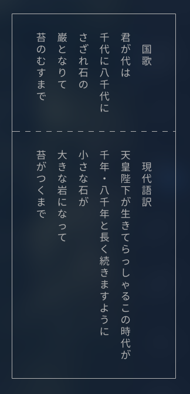

# kimigayo

🇯🇵 A minimal command-line tool to play "君が代"

---

## Features

- 🎵 Plays the Japanese national anthem (君が代)
- 🧱 Displays vertical Japanese lyrics in a bordered box
- 💻 Works entirely offline — MP3 is bundled
- 🐚 Lightweight: pure Bash

---

## Installation

### macOS (via Homebrew)

```sh
brew tap politive/kimigayo
brew install kimigayo
```

```sh
kimigayo                   # Display lyrics and play the anthem (uses afplay by default)
kimigayo --player mpg123   # Use a custom player command (e.g., mpg123)
kimigayo --help            # Show usage instructions
```

## output

